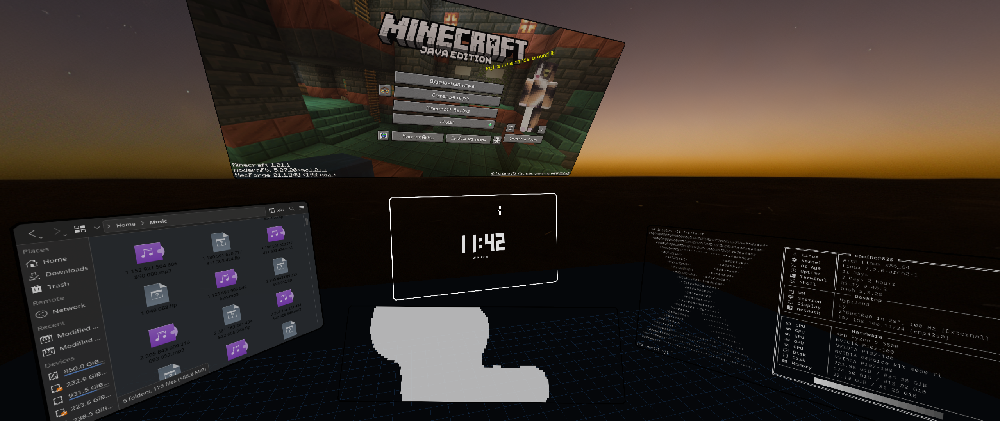

# Hypr3D =^..^=



**A new perspective on window management -- literally.**
A Hyprland plugin that turns your workspace into a walkable 3D space where
windows float in mid-air, ready to be grabbed, dragged and resized.

> Experimental, pinned to Hyprland 0.56.2.

> It's kinda buggy, but I'm working on it.
## Installation
### Hyprpm

```bash
hyprpm add https://github.com/samine825/Hypr3D
hyprpm enable Hypr3D
```

(`hyprpm update` picks up new commits.)


### Manual

```bash
# Build
cmake -S . -B build -DHYPRLAND_HEADERS=/var/cache/hyprpm/$USER/headersRoot
cmake --build build -j$(nproc)

# Load
hyprctl plugin load "$PWD/build/hypr3d.so"
```

# Use

To enable 3D:

```bash
hyprctl eval 'hl.plugin.hypr3d.toggle()'
```

Or bind in lua config:

```lua
hl.bind("SUPER + F12", hl.plugin.hypr3d.toggle)
```


## Controls

| Input                         | Action                                                   |
| -------------------------------| ----------------------------------------------------------|
| Mouse move                    | Look around                                              |
| WASD                          | Move                                                     |
| Shift / Space                 | Move down / up                                           |
| Ctrl                          | Sprint                                                   |
| Super + Left click            | Drag window                                              |
| Super + Right click           | Resize window                                            |
| Super + Mouse wheel click     | rotate window                                            |
| Super + Mouse wheel scrolling | Zoom in on or zoom out from a window under the crosshair |
| Super + Left Alt              | Toggle keyboard mode (movement / window input)           |

## Configuration
### Lua config

```lua
if hl.plugin.hypr3d then
hl.config({
    plugin = {
        hypr3d = {
            -- U can set a panorama pic:
            panorama = "~/panorama.png",
            -- That's all for now :p
        },
    },
})
end
```