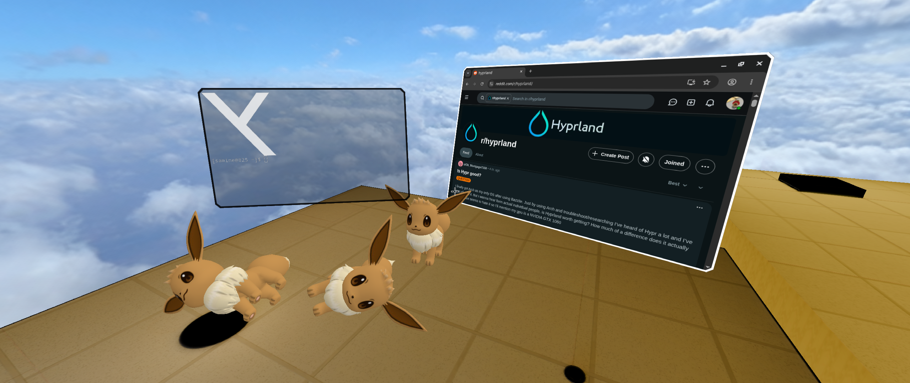
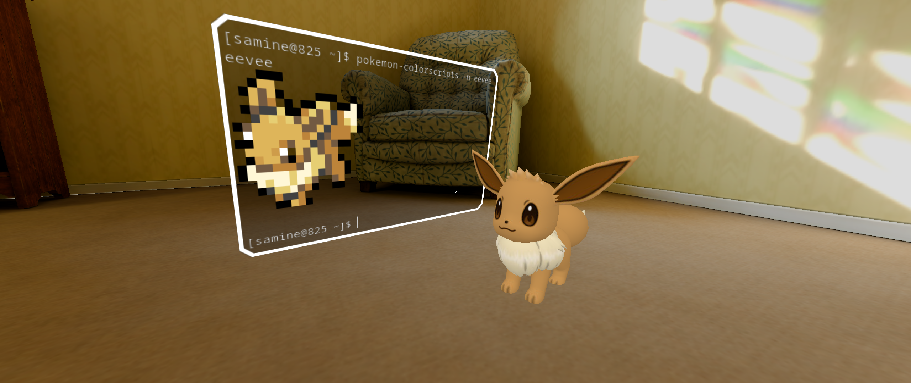
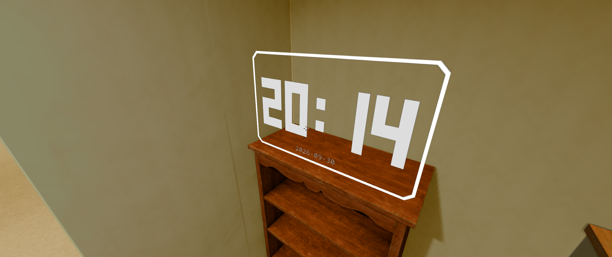
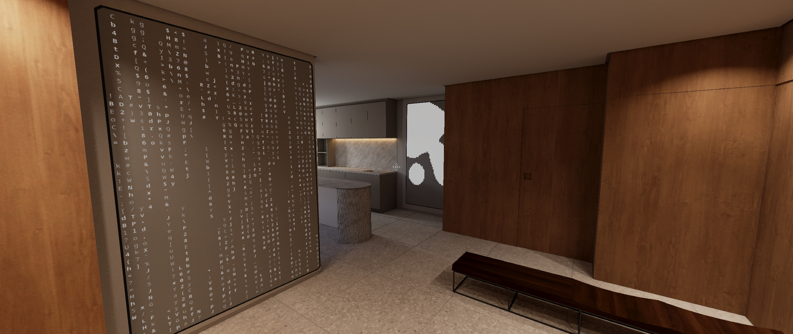
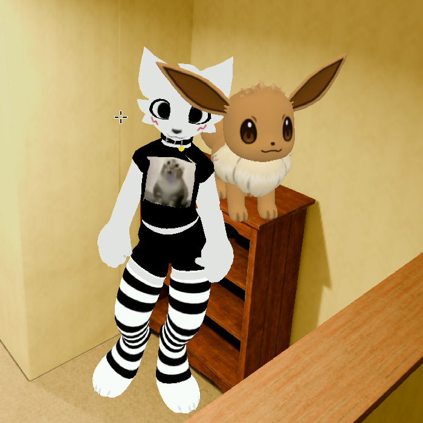

<div align="center">


# Hypr3D =^..^=

**A new perspective on window management - literally.**
A Hyprland plugin that turns your workspace into a walkable 3D space

[Installation](#installation) · [Use](#use) · [Configuration](#configuration) · [Report a bug / suggest a new feature](https://github.com/samine825/Hypr3D/issues)


</div>

# <a name="installation"></a> Installation
## Hyprpm

```bash
# Install latest
hyprpm add https://github.com/samine825/Hypr3D
hyprpm enable Hypr3D

# Update
hyprpm update
```


## Manual

```bash
# Build
cmake -S . -B build -DHYPRLAND_HEADERS=/var/cache/hyprpm/$USER/headersRoot
cmake --build build -j$(nproc)

# Load
hyprctl plugin load "$PWD/build/hypr3d.so"
```

# <a name="use"></a> Use

To enable 3D:

```bash
hyprctl eval 'hl.plugin.hypr3d.toggle()'
```

Or bind in lua config:

```lua
hl.bind("SUPER + F12", hl.plugin.hypr3d.toggle)
```

Leaving the room keeps it as it was: where you stood and looked, the view (F5)
and where every window stood -- for as long as Hyprland runs. To start over at
the spawn point with the windows in front of you:

```bash
hyprctl eval 'hl.plugin.hypr3d.reset()'
```

(or the dispatcher `hypr3d:reset`)

### The companion

A second avatar can stand in the room, a blue capsule, driven from outside --
by an AI through a bridge process, or by hand:

```bash
hyprctl eval 'hl.plugin.hypr3d.companion("go_to", "foot")'
```

| Call | What it does |
| --- | --- |
| `companion("go_to", target)` | walks a straight line and stops in front of the target, facing it |
| `companion("look_at", target)` | turns to face the target |
| `companion("see")` | takes one picture from its eye, at most one a second |
| `companion("stop")` | stops at once |
| `companion("state")` | posts the room event now |

A target is `player` (it stops within 1.5 m of you), `spawn`, or a window in
the room by its app class in lower case: `foot`, and `foot 2` for a second
one. A window keeps its number while it lives. When the room is closed or the
target unknown, the call fails and `hyprctl eval` prints why, for example
`error: companion: Unknown target 'firefox'. Targets now: player, spawn, foot`.
It never walks into you or off the floor.

What happens goes out on Hyprland's event socket (`.socket2.sock`) as
`hypr3d>>{json}`, each stamped with `CLOCK_MONOTONIC` nanoseconds in `t`:

- `{"event":"room","open":true,"targets":[{"name":"player"},{"name":"spawn"},{"name":"foot","title":"~"}],...}`
  when the room opens, closes (a fullscreen window closes it too) or a window
  comes or goes;
- `{"event":"companion","state":"first_step"|"arrived"|"blocked"|"aborted","target":"foot",...}`,
  with a `reason` for `blocked` and `aborted`;
- `{"event":"sight","path":".../hypr3d-sight.jpg","width":768,"height":432,"fov":90,"taken":...}`
  once the picture `see` asked for lies next to Hyprland's sockets, `taken` being
  the frame that drew it -- or `{"event":"sight","error":"..."}` when the room
  closed first or nothing came back within 2 s.

The picture is the room as the companion sees it, 90 degrees across, level
along its facing: you as your player model, or as an orange capsule without
one. It is drawn with the next frame and read back a frame or more later
without stalling the compositor; the frame that draws it costs about 0.6 ms
more, the JPEG about 1 ms (measured on the Moon station).

It appears on the first call, beside the spawn, and its body lives as long as
the plugin: leaving the room keeps it where it stood, `reset()` puts it back
beside the spawn.

### Portals

A portal is a picture standing in the room; walk into it and its command
runs, through Hyprland's own executor -- as an exec keybind would run it:

```bash
hyprctl eval 'hl.plugin.hypr3d.portal("deltarune", { image = "/path/face.png", command = "steam steam://rungameid/1671210", at = { -6.5, 0, -1 }, yaw = 90 })'
hyprctl eval 'hl.plugin.hypr3d.portal("deltarune", { image = "/path/face.png", command = "steam steam://rungameid/1671210", front = true })'
hyprctl eval 'hl.plugin.hypr3d.portal("deltarune")'   -- removes it
```

| Field | What it is |
| --- | --- |
| `image` | the picture, PNG or JPEG; its transparent pixels are cut out |
| `command` | run once each time the player steps into the portal's middle, not twice within 3 s |
| `at` | the floor point under its middle; or `front = true`: 2.5 m in front of the player, facing him |
| `yaw` | the direction it faces, degrees, as the camera's yaw; default: towards the spawn |
| `width` | metres, default 1.8; the height follows the picture |

Each start goes out on socket2 as `{"event":"portal","name":"deltarune","started":true,...}`.
A portal lives as long as the plugin; a wrong call fails with the reason.

### The waste bin

```lua
hl.plugin.hypr3d.config({ trash = { at = { 3, 0, 0.6 }, radius = 0.29, height = 0.72 } })
```

Carry a window (Super + left click), look at the bin and let go: the
window tumbles into it, shrinking like a sheet crumpled up, and is asked to
close, as Super+Q asks. An application that stays open -- an unsaved file
asks first -- gets its window back after 3 s. `trash` is only the zone, a
vertical cylinder standing at `at`; what the bin looks like is a scene
object you put at the same place. `radius = 0` takes the bin away.

### The menu

```lua
hl.plugin.hypr3d.config({ menu = { command = "my-room-menu", title = "My room" } })
```

F1 in the room runs `command` (through Hyprland's executor, as an exec
keybind); a window whose title is `title` comes to the eye at 1:1 as it
opens, as F2 brings one, and goes when it closes. The menu itself is any
program that opens such a window -- Larch's is `larch-room-menu`.

### Resetting the windows

```bash
hyprctl eval 'hl.plugin.hypr3d.windows("reset")'   -- every window back in front of you
hyprctl eval 'hl.plugin.hypr3d.windows("undo")'    -- and where they were again
```

`reset` puts every window where a window new to the room goes -- on the wall
or the arc in front of the camera -- and leaves the player and the menu where
they are; `reset()` also takes the player back to the spawn. The poses before
are kept for one `undo`. Both fail with the reason when there is nothing to do.

### The crosshair

The crosshair's shape says what it points at: brackets on a window, a ring
on an object -- blue when Super + drag carries it, white when it is fixed in
place --, a diamond on a portal, a dot on anything else. Once the aim has
rested on a window, an object with a `label` or a portal for 120 ms, a label
under it names it and the keys that work there; after 2 s it folds to the
name. Carrying a window over the waste bin, the ring turns red and the label
says that letting go closes it. With the process gun (F7) the mark is a red
cross, the label adds the process number, and a pill at the top says the gun
is out.

A window in use -- Super+F's screen, the F1 menu, F8 -- shows Larch's arrow
where its pointer is. A blue ring shows where it is when the window comes in
front, and again on the first move after 2 s still. On Super+F's screen a
pill at the bottom says how to get back; it fades out after 3 s and comes
back with the ring.

### The room's state

The plugin writes flying, gravity and the HUD as `key=value` lines to
`$XDG_RUNTIME_DIR/hypr/$HYPRLAND_INSTANCE_SIGNATURE/hypr3d-state` whenever
they change, for a menu to show.

## Controls

| Input                         | Action                                         |
| -------------------------------| ------------------------------------------------|
| Mouse move                    | Look around                                    |
| WASD                          | Move                                           |
| Space                         | Jump (hold for higher) / move up (flying)      |
| Space twice                   | Toggle flying                                  |
| Shift                         | Crouch (walking) / move down (flying)          |
| Ctrl                          | Sprint                                         |
| C                             | Zoom, wheel adjusts                            |
| Super + Left click            | Drag window; let go on the waste bin to close it |
| Super + Right click           | Resize window                                  |
| Super + Mouse wheel click     | rotate window                                  |
| Super + Mouse wheel scrolling | Zoom window                                    |
| Super + Left Alt              | Toggle keyboard mode (movement / window input) |
| F3                            | Toggle debug HUD                               |
| F1                            | The room's menu (config `menu.command`)        |
| F2                            | Read: the aimed window comes to you at 1:1, again sends it back |
| F4                            | Cinema: the aimed window as big as the view, the room dark around it; again sends it back |
| F5                            | Switch camera view                             |

# <a name="configuration"></a> Configuration

## Lua config example:

```lua
if hl.plugin.hypr3d then
    hl.bind("SUPER + F12", hl.plugin.hypr3d.toggle)
    hl.plugin.hypr3d.config({
        world = {
            panorama = "~/panorama.png",
            grid = false,
        },
        windows = {
            window_scale = 0.25,
            spawn_distance = 2,
        },
        player = {
            mesh = {
                path = "~/player.gltf",
                transform = {
                    rotation = {0, 90, 0},
                    scale =    {1.5, 1.5, 1.5},
                },
                emissive_scale = 1.0,
                flat = true,
                center = "origin",
            },
            animations = {
                idle = {source = "Idle"},
                walk = {source = "Walking"},
                run = {source = 2},
                jump = {source = 3, duration_scale=2.4},
            },
            collision = true,
            move_speed = 1.5,
            spawn = {0, 67, 0},
            flying = false,
            walk_bob = true
        },
        scene = {
            mymap = {
                mesh = {
                    path = "~/scene.gltf",
                    transform = {
                        position = {1, 0, 0},
                    },
                    emissive_scale = 1.0,
                    center_offset = {0, 34, 0},
                },
                collision = true,
                static = true,
            },
            anyname = {
                mesh = {
                    path = "eevee.gltf",
                    transform = {
                        position = {y = 3},
                        scale =    {2, 2, 2},
                    },
                    emissive_scale = 1.0,
                    flat = true,
                    center = "origin",
                    center_offset = {0, 20, 0},
                },
                collision = true,
                static = false,
                physics = true,
            },
        }
    })
end
```


## Parameters

Everything is optional -- only set what you want to change. 

### World

| Option   | Type   | Default | Description                             |
| ----------| --------| ---------| -----------------------------------------|
| panorama | string | ""      | 360° background image (equirectangular) |
| grid     | bool   | true    | the starting 40x40 platform             |
| monitor  | string | ""      | render the 3D view on this monitor (e.g. "DP-1") instead of the focused one |
| span     | bool   | true    | with several monitors, one room across all of them: each monitor shows the part of the room where it sits in the layout (an off-axis view, like a triple-screen simulator), and the windows of every monitor enter as a wall where they stood; the eye sits in front of `monitor` (or the focused one). The wall is sized so its lowest monitor ends just above your feet -- nearer and smaller than `window_scale` would put it, the same on screen. `false`: the room on that one monitor only |
| gravity  | float  | 14.0    | how fast things fall (m/s²) -- the player too; the Moon is 1.62 |

### Windows

| Option         | Type  | Default | Description                             |
| ----------------| -------| ---------| -----------------------------------------|
| window_scale   | float | 0.5     | window size multiplier (at 100 px/m)    |
| spawn_distance | float | 5.0     | how far from you new windows appear (m) |
| depth          | float | 0.05    | window slab thickness in world units (0 = flat quads); the walls follow the window's rounded corners and are painted with the texture's edge colors |

### Player

| Option           | Type                                | Default     | Description                                             |
| ------------------| -------------------------------------| -------------| ---------------------------------------------------------|
| mesh             | [Mesh](#mesh)                       | {}          | object's visual                                         |
| animations       | [Animation Group](#animation-group) | {}          | which clip each movement state plays                    |
| look_sensitivity | float                               | 0.0025      | how fast the camera turns (radians per pointer count)   |
| look_inertia     | float                               | 0.03        | camera coasting after you stop the mouse (in seconds)   |
| move_inertia     | float                               | 0.18        | flight: how long speeding up and coasting take (seconds) |
| move_speed       | float                               | 4.0         | how fast you walk (m/s, running - 2.5x)                 |
| spawn            | [Vector3](#vector3)                 | { 0, 0, 0 } | player spawn point                                      |
| flying           | bool                                | true        | disables falling                                        |
| walk_bob         | bool                                | true        | simulate the rhythm of walking                          |
| collision        | bool                                | true        | whether body collides with the world                    |

### Scene

| Option          | Type                          | Default | Description                        |
| -----------------| -------------------------------| ---------| ------------------------------------|
| any unique name | [Scene Object](#scene-object) | {}      | u can place any number of objects. |

### <a name="scene-object"></a> Scene Object

| Option    | Type          | Default | Description                                          |
| -----------| ---------------| ---------| ------------------------------------------------------|
| mesh      | [Mesh](#mesh) | {}      | object's visual                                      |
| collision | bool          | true    | whether body collides with the world                 |
| static    | bool          | true    | you can't pick it up and carry it; suitable for maps |
| physics   | bool          | false   | enable jolt physics (only if static=false)           |
| label     | string        | ""      | its name in the crosshair's label; a static object without one is scenery and gets none |
| note      | string        | ""      | what it is for, after the name in the label          |

Want only part of a model to be solid? Rename those nodes in Blender to
start with `nocol` -- they'll still render, but you'll walk right through.

### <a name="mesh"></a> Mesh

| Option         | Type                    | Default   | Description                         |
| ----------------| -------------------------| -----------| -------------------------------------|
| path           | string                  | ""        | the model file to load (.glb/.gltf) |
| transform      | [Transform](#transform) | {}        | idk                                 |
| emissive_scale | float                   | 1.0       | how bright the model's own light is |
| flat           | bool                    | false     | trust the model's lighting as-is    |
| center         | string                  | logical   | origin / logical                    |
| center_offset  | [Vector3](#vector3)     | {0, 0, 0} | Extra shift of the rotation pivot   |

### <a name="animation-group"></a> Animation Group

| Option | Type                    | Default |
| --------| -------------------------| ---------|
| idle   | [Animation](#animation) | {}      |
| walk   | [Animation](#animation) | {}      |
| run    | [Animation](#animation) | {}      |
| jump   | [Animation](#animation) | {}      |

### <a name="animation"></a> Animation

| Option         | Type       | Default | Description                                                       |
| ----------------| ------------| ---------| -------------------------------------------------------------------|
| source         | int/string | {}      | which anim to play: its name in the file, or its zero-based index |
| duration_scale | float      | 1.0     | playback speed multiplier                                         |

### <a name="transform"></a> Transform

| Option   | Type                | Default   |
| ----------| ---------------------| -----------|
| position | [Vector3](#vector3) | {0, 0, 0} |
| rotation | [Vector3](#vector3) | {0, 0, 0} |
| scale    | [Vector3](#vector3) | {1, 1, 1} |

### <a name="vector3"></a> Vector3

Vectors can be written either way: `{ x = 1, y = 2, z = 3 }` or just `{ 1, 2, 3 }`.

# Screenshots
<table>
  <tr>
    <td align="center" width="25%"></a></td>
    <td align="center" width="25%"></a></td>
  </tr>
  <tr>
    <td align="center" width="25%"></a></td>
    <td align="center" width="25%"></a></td>
  </tr>
<tr>
    <td align="center" width="25%"></a></td>
    <td align="center" width="25%"></a></td>
  </tr>
</table>
